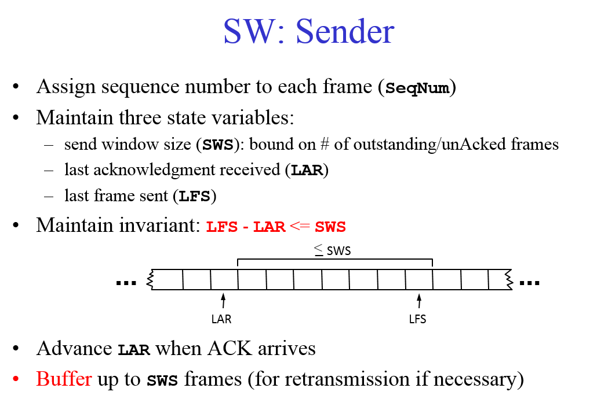
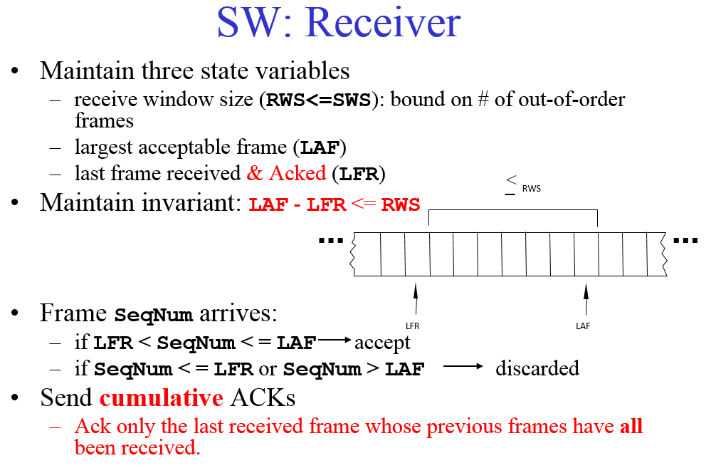
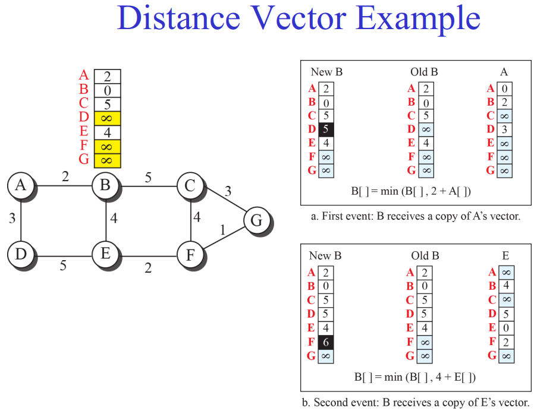
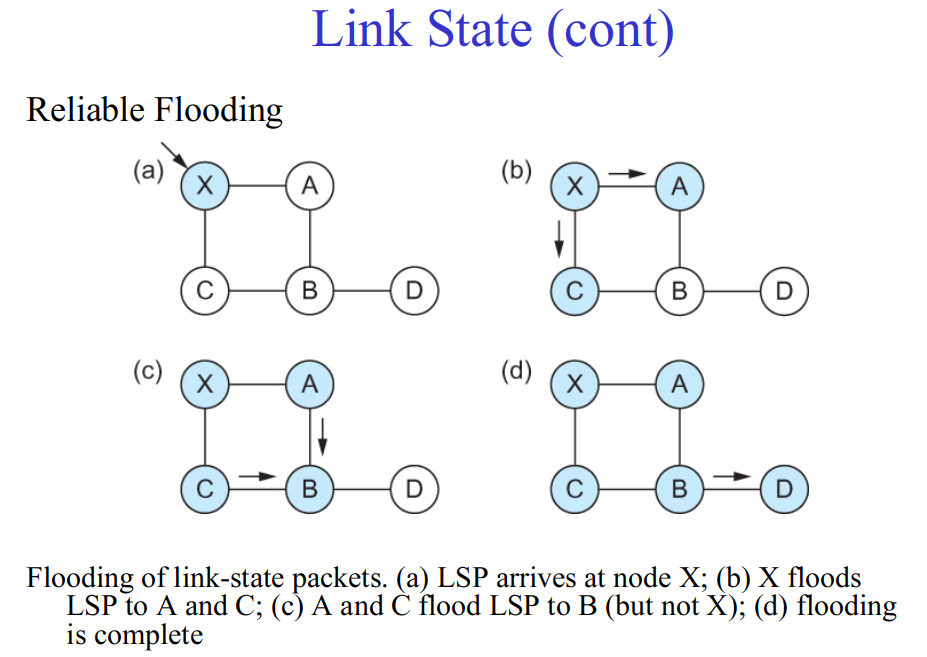
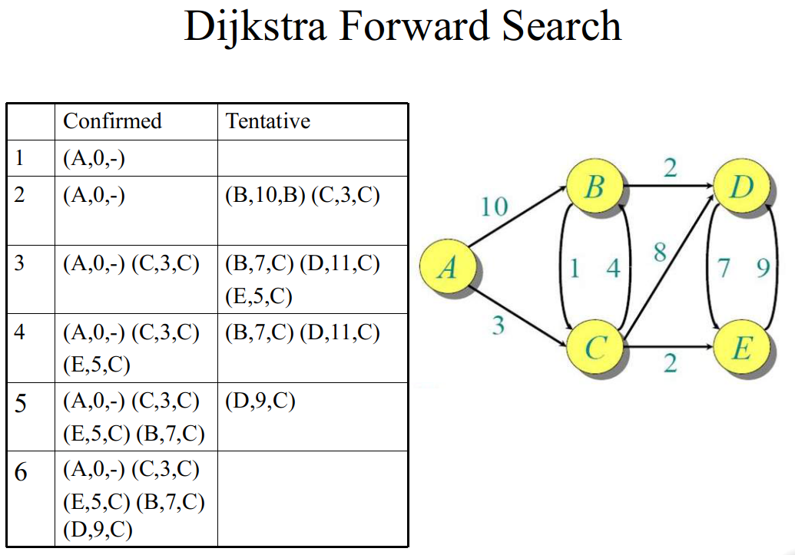
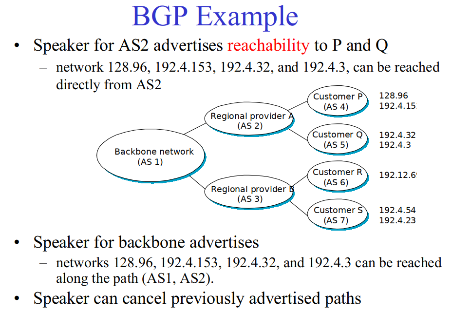

# Introduction
## Strategy
### Circuit switching
Waste resource if the connection is established by not in use.
### Packet switching
### Sychronous Time Multiplexing & Frequency Multiplexing
Not scalable
Waste resource when allocated time slot/ frequency is not in use
### Statistical Multiplexing
- Used in Internet
## Addressing
Byte string that identifies a node
Type of addresses
- unique: node-specific
- broadcast: all nodes on the network
- multicast: some subset of nodes on the network
## Forwarding
A local term. Get packet from one of its port, and decide which port to send.
## Routing
## Performance
- Latency
  - initial time to set up communication (setup time)
  - time takes to put data block on link (transimit time)
    ```data size/bandwith```
  - link delay (propagation delay)
    ```=link distance/c(light speed)```
  - router delay (queuing delay)
  - 
- Throughput
  ```=size of data block/latency```

A trap: 
- File Size in capital ``B``, such as: ``KB, MB, GB`` is based 2
- bandwidth in lower case ``b``, such as ``Mbps, Gbps`` is based 10.
Example:

# Link
## Problems
### Signal deteriation
Over a distance, the signal itself can deteriate. -> addaptive threshold (lower threshold when receiving 0) for a low voltage to be recognized as a 0
There can be noises, so that a sqaure wave is not a square wave anymore (guigle)
If send consecutive 1s and 0s, the threshold may be too low that any white noise would causing a wrong bits.
### Synchronization
Receiver and sender may not well-syncrhonized, so that the sampled signal is out of clock and wrong.
#### Manchester
#### Sentinal-based
#### Clock-based
### Error
Bit-level errors (caused by interference)  
Error detection probability <-> Overhead
#### Detection
Through addition of redundant information to frame.  
Error detection code is **overhead**, without carrying any data
- Parity
- CRC(Cyclic Redundancy Check)
  - Add ``k`` bits of redundant data to an ``n`` bits message, when ``k << n``
  - Represent n-bit message as n-1 degree polynomial
    - eg. MESSAGE=10011010 as M(x)=x^7+x^4+x^3+x^1
  - Let k be the degree of some divisor polynomial
    - eg. C(x)=x^3+x^2+1
  - Transimit polynomial P(x) that is evenly divisible by C(x)
    - shift left k bits, ie. M(x)*x^k
    - subtract the remainder of ``M(x)*x^k/C(x)`` from ``M(x)*x^k``, ie. P(x)=M(x)*x^k-[remainder of M(x)*x^k/C(x) ]
  - hardware implementation: feedback shift register
- Checksum
  + cannot be implemented efficiently by hardware (binary addition, implemented as software programs)
  + 
## Reliable Transimition
### Stop and Wait Algorithm
- After transimited 1 frame, the Sender(S) waits for ACK before transimitting the next frame
- If time out, retransimit  
Problem: 
1. duplicate frames
2. The sequence number may also get flipped, causing errors
3. The bandwidth utilization is low.
### Sliding Window



# IP
## The internet network layer
- IP stands for Internet protocol
- Runs on all the nodes in a collection of networks and defines the infrastructure that allows the nodes and networks to function as a **single logical internetwork**.
## Model
- Connectionless
- Best-effort (unreliable)
  + packets can lost
  + packets can be delivered out of order
  + there may be duplicate packets
  + can be delayed
## Fragmentation and reassembly
Because each network has some MTU ``(max. transmission unit)``, so big packets needs to be disassembled.
![]
## IP address classes

- class A: 126 networks with 16 million hosts each
- class B: 16K networks with 64K hosts each
- class C: 2 million networks with 254 hosts each  
Network ID = IP & class mask (bit wise and)
- Class A networks: Mask = 255.0.0.0
- Class B networks: Mask = 255.255.0.0
- Class C networks: Mask = 255.255.255.0

## Subnetting
Solve the problem of inefficient use of hierarchical address space: further divide the addresses within one class  
IP (known to world):        Network Number | Host number  
Subnetted (known to site):  Network Number | subnet number | Host number    
Subnet mask (known to site):11111111111......11111111111111|0...00000000    
Subnet number = IP & subnet mask
### Forwarding algorithm
```
forward(Destination)
{
    for each entry (SubnetNum, SubnetMask, NextHop)
    {
        D'=SubnetMask & Destination
        if D'=SubnetNum
        {
            if(NextHop is interface)
                ->D
            else
                ->NextHop
        }
        else
            -> default router
    }
}
```
## Supernetting
Combine some smaller networks into one class of addresses: assign one class block of addresses to nearby networks.  
CIDR: (classless interdomain routing)
- network number portion is determined by an extra number ``IP/x``, where x is number of bits in the network number part
- all routers must implement CIDR
IP:   Network Number | Host number /x
      |     ...      |
         x bits long


## Supernetting vs Subnetting
- Subnetting is used to share one network address among multiple physical networks within an organization (AS)
- CIDR aims to collapse the multiple network addresses that would be assigned to a single or multiple AS onto one (supernet) address. 
## ARP (address resolution protocol)
How to determines a node's MAC address knowing the IP address?
### Possible solution
- Encode physical address in host part of IP address X
- ARP
  + Table: IP -> MAC
  + broadcast request if IP address is not in the table
  + target machine responds with its MAC
  + timeout machanics

## Routing
### Forwarding vs routing
- forwarding: select an output port based on destination and routing table
- routing: the process of building a routing table
### Problem
Find the lowest cost path between src<->dest.  
Factors:
- static: topology
- dynamic: load
## Algorithms
### Distance vector routing algorithm (RIP)
- Each node maintains a set of triples ``{Destination, Cost, NextHop}``
- Directly connected neighbors exchange updates ``{Destination, Cost}``
- Update if 
   1. smaller cost
   2. came from next-hop


### Link State (OSPF: open shortest path first)
- send to **all** nodes (not just neighbors) information about **directly connected links**
- Reliable flooding:
  + store most recent LSP from each node
  + forward to all connected nodes except one that received from
  + decrement TTL (discard when TTL=0)
  
- Dijkstra's forwad search algorithm
  1. Initialize ``Confirmed`` with current node (S,0,-)
  2. For node just added ``Next``, select its LSP
  3. For each neighbor ``N`` of ``Next``, ``cost(S,N)=cost(s,Next)+cost(Next,N)``. 
    - If N is not in ``Confirmed`` or ``Tentative``, add (N, Cost, NextHop) -> ``Tentative``.
    - If N is in ``Tentative`` and cost<current cost, replace the entry
  4. If ``Tentative`` is empty, stop. Else, pick the least cost in ``Tentative`` -> ``Confirmed``, select as ``Next``. Goto 2.
  

### Interdomain (BGP)
