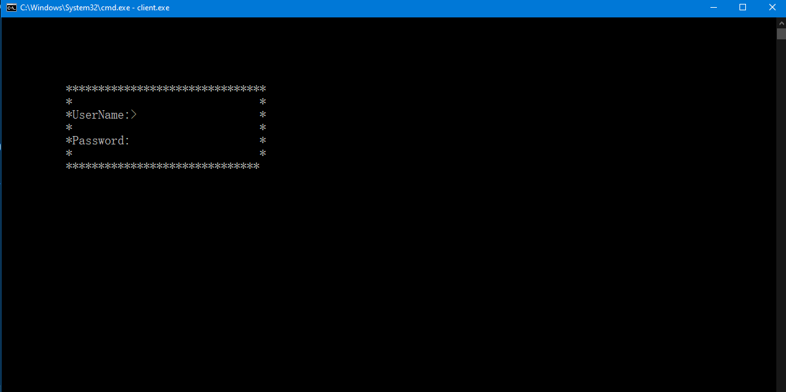

# Version 2
## Compared with V1
V2 supports multiple clients. This functionality is achieved by using ``std::thread`` in the server side.

Also:

I implemented a fancy UI (maybe not that fancy but whatever) for client side.

It's just me trying out my Console engine.

You can press 'n' when launching for what is required on the assignment for the traditional command interface.

Additionally, I write good documentation :)

Both client and server will use 127.0.0.1 as the default IP address if not specified in the command line.

## Run
- The server executable is located at ``/server/Debug/server.exe``
- The client executable is located at ``/client/Debug/client.exe``

## Note: 
- The server will display the user and password stored on the disk because of debugging purposes. **To DISABLE that, you can compile with Release mode in Visual Studio.**
- In case of encoding issue, type ``chcp 936`` in your command line first then run the ``client.exe`` executable.

## Screenshot
1. login

2. sending message

3. Multiple client chatting

